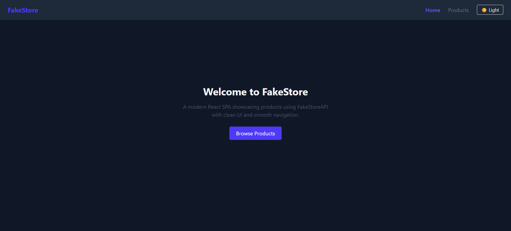
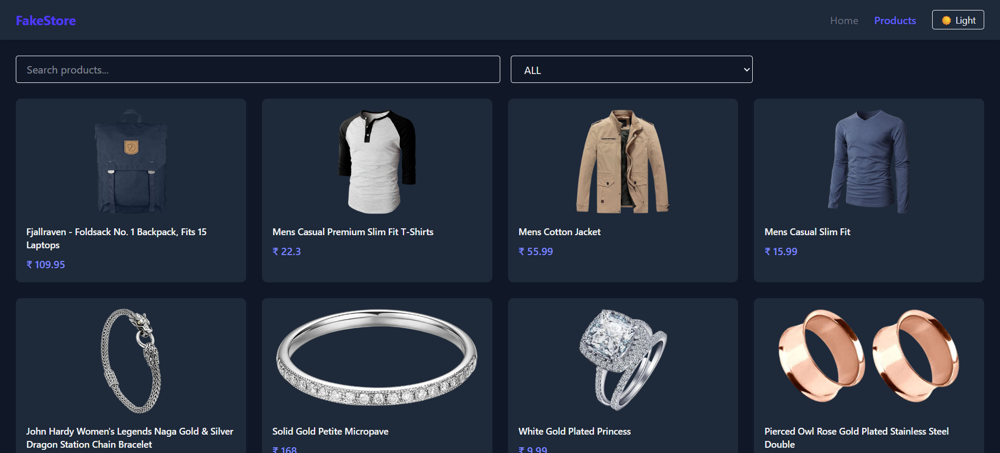
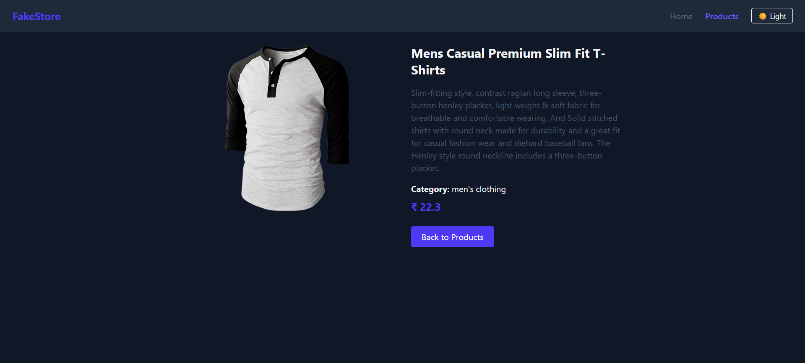

# FakeStore React SPA

A clean and responsive Single Page Application built using React and Vite.  
The application fetches product data from FakeStoreAPI and demonstrates routing, reusable components, API handling, and modern UI design using Tailwind CSS.

---

## Features

- Single Page Application (SPA)
- Client-side routing with React Router
- Product listing and product detail pages
- API integration using Fetch API
- Loading and error handling states
- Search and category-based filtering
- Dark mode with persistent theme
- Responsive UI for all screen sizes

---

## Tech Stack

- React (Functional Components)
- Vite
- React Router DOM
- Fetch API
- Tailwind CSS

---

## API Used

**FakeStoreAPI**

Base URL:
https://fakestoreapi.com/products


Endpoints used:
- `/products` – Fetch all products
- `/products/:id` – Fetch single product details

---

## Application Routes

| Route | Description |
|------|-------------|
| `/` | Home page |
| `/products` | Product listing page |
| `/products/:id` | Product detail page |

---

## Project Structure

src/
├── components/
│   ├── Navbar.jsx
│   ├── Card.jsx
│   ├── Button.jsx
│   ├── Loader.jsx
│   └── ErrorMessage.jsx
├── pages/
│   ├── Home.jsx
│   ├── ProductList.jsx
│   └── ProductDetail.jsx
├── services/
│   └── api.js
├── App.jsx
└── main.jsx


---

## Screenshots

### Home Page


### Products Page


### Product Detail Page


---

## Challenges & Learnings

- Handling asynchronous API calls using proper loading and error states
- Implementing client-side filtering without additional API requests
- Managing global UI state for dark mode using localStorage
- Structuring reusable and maintainable components

---

## How to Run the Project

```bash
npm install
npm run dev

```
## Author

**Thota Lokesh**  
Frontend Developer | React
